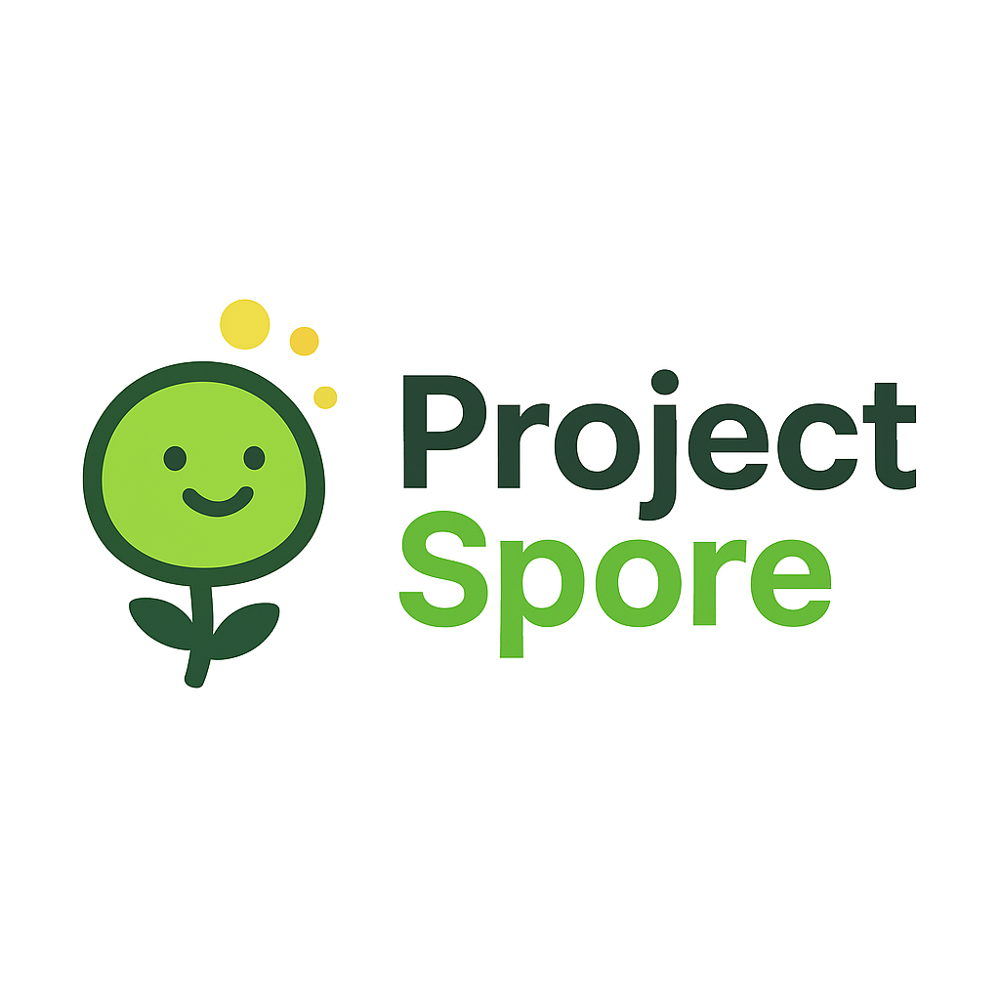

When users first arrive at my "vibe coders" social media website, they will be greeted with a landing page. This page will be pretty simple to start, it will show our black and white website, borderless look, with green accents that match Image_1. The goal is to make this feel light and easy. There will be a login and sign up button on the top right.

When users clock "Sign Up" they will be brought to a page where they will be greeted by a few varification methods for sign up (Google, GitHub). They will select their provider and move through the necessary steps for each to create a sign in with Spore.

"Login" will work similar to "Sign Up", except it will be for users who have already signed up.

Once a user is signed up or logged in, they will hit their user homepage. Here they will be able to see their feed, post, comment on posts, and follow users.

The user will have access to their public user page via their homepage, which will display an avatar, repos they have connected, and websites they have connected. Its going to be very basic for now, user bio, project interests, things of that nature. It will also allow users to access who they are following, and whos following them.

The outcome should be a single working flow. Sign up -> create post -> follow -> comment